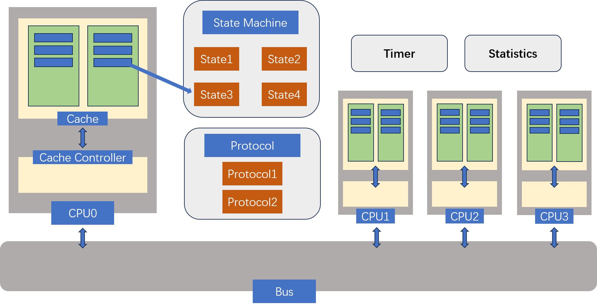
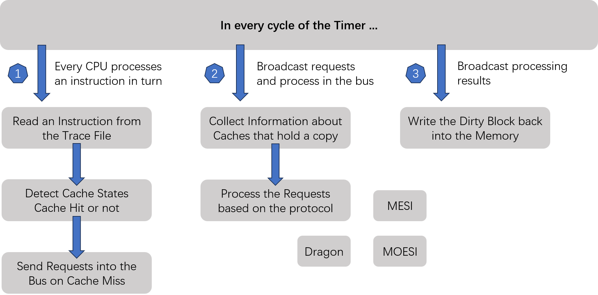

# CC-UMA-Simulator

This is the course project for CS4223 at NUS. Instead of forming a team, I implemented the whole project on my own, which is a cool thing. The simulator is implemented in c plus plus and managed by cmake and makefile, so it can be easily reused by modifying a few paths.

Three cache-coherent protocols are implemented and they are MESI, MOESI, and Dragon protocols. Theoretically speaking, if you understand the logic of the project, it can be extended to more and more protocols easily, which is exactly my original intention.

The architecture of the CC-UMA-Simulator:

The flow chart demonstrating the most basic code logic:

That's all! Gracias!!
